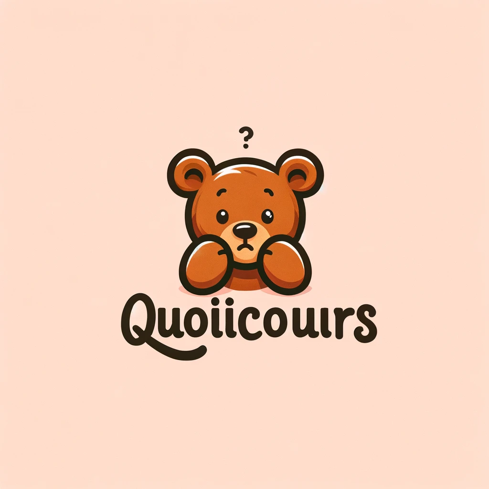

# QuoicOurs

# Résumé: Génie Logiciel

## Présentation

Le génie logiciel repose sur l'art de concevoir des logiciels et d'améliorer la façon de les concevoir.

L'ingénieur cherche à optimiser ses processus de travail.

La mauvaise compréhension du besoin est l'une des premières causes d'échec des projets informatiques.

## Projet exemple

L'association CultureDiffusion souhaite réaliser une bibliothèque numérique à gestion décentralisée.

Le principe est de permettre à chaque membre de numériser les œuvres et aux bibliothécaires de les proposer à l'emprunt selon deux modalités:

- Œuvres du domaine public accessibles gratuitement
- Œuvres sous droits proposées en location

L'application possède quatre rubriques:

- Fond commun
- Emprunts
- Séquestre
- À modérer

## Repérage des mots clés

Concepts, noms propres, actions, propriétés

## Glossaire

Définitions des concepts clés

## Scénarios

Description des scénarios principaux:

- Installer l'application
- Devenir membre
- Devenir bibliothécaire
- Déposer une œuvre
- Modérer une œuvre
- Etc.

## Diagrammes

- Cas d'utilisation
- Séquences
- Classes
- Etc.

## Architecture

Choix d'architecture et patterns de conception.
