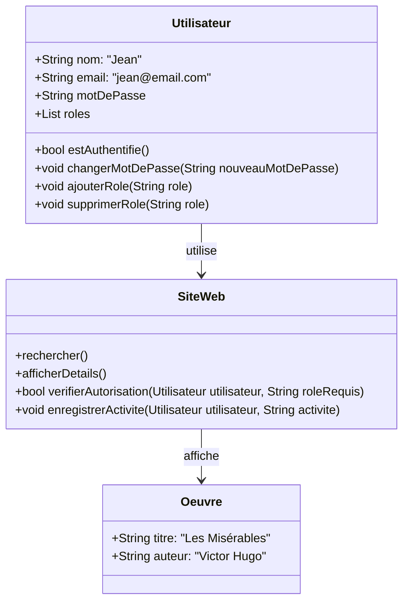

```mermaid
classDiagram
    class Utilisateur {
      +String nom: "Jean"
      +String email: "jean@email.com"
      +String motDePasse
      +bool estAuthentifie()
      +void changerMotDePasse(String nouveauMotDePasse)
      +List<String> roles
      +void ajouterRole(String role)
      +void supprimerRole(String role)
    }
    class SiteWeb {
      +rechercher()
      +afficherDetails()
      +bool verifierAutorisation(Utilisateur utilisateur, String roleRequis)
      +void enregistrerActivite(Utilisateur utilisateur, String activite)
    }
    class Oeuvre {
      +String titre: "Les Misérables"
      +String auteur: "Victor Hugo"
    }

    Utilisateur --> SiteWeb : utilise
    SiteWeb --> Oeuvre : affiche
```
