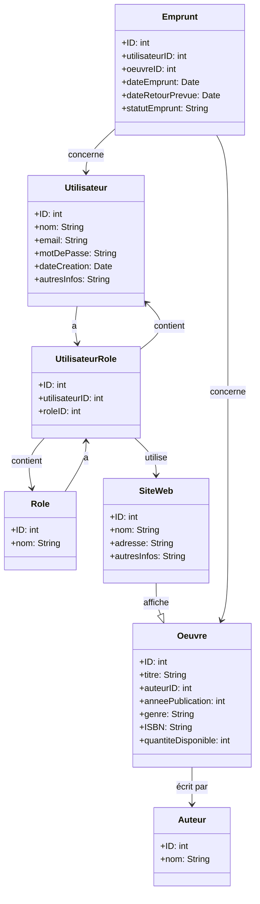

```mermaid
classDiagram
    class Utilisateur {
      +ID: int
      +nom: String
      +email: String
      +motDePasse: String
      +dateCreation: Date
      +autresInfos: String
    }
    class Role {
      +ID: int
      +nom: String
    }
    class UtilisateurRole {
      +ID: int
      +utilisateurID: int
      +roleID: int
    }
    class SiteWeb {
      +ID: int
      +nom: String
      +adresse: String
      +autresInfos: String
    }
    class Oeuvre {
      +ID: int
      +titre: String
      +auteurID: int
      +anneePublication: int
      +genre: String
      +ISBN: String
      +quantiteDisponible: int
    }
    class Auteur {
      +ID: int
      +nom: String
    }
    class Emprunt {
      +ID: int
      +utilisateurID: int
      +oeuvreID: int
      +dateEmprunt: Date
      +dateRetourPrevue: Date
      +statutEmprunt: String
    }

    Utilisateur --> UtilisateurRole : a
    Role --> UtilisateurRole : a
    UtilisateurRole --> Utilisateur : contient
    UtilisateurRole --> Role : contient
    UtilisateurRole --> SiteWeb : utilise
    SiteWeb --|> Oeuvre : affiche
    Oeuvre --> Auteur : écrit par
    Emprunt --> Utilisateur : concerne
    Emprunt --> Oeuvre : concerne
```
