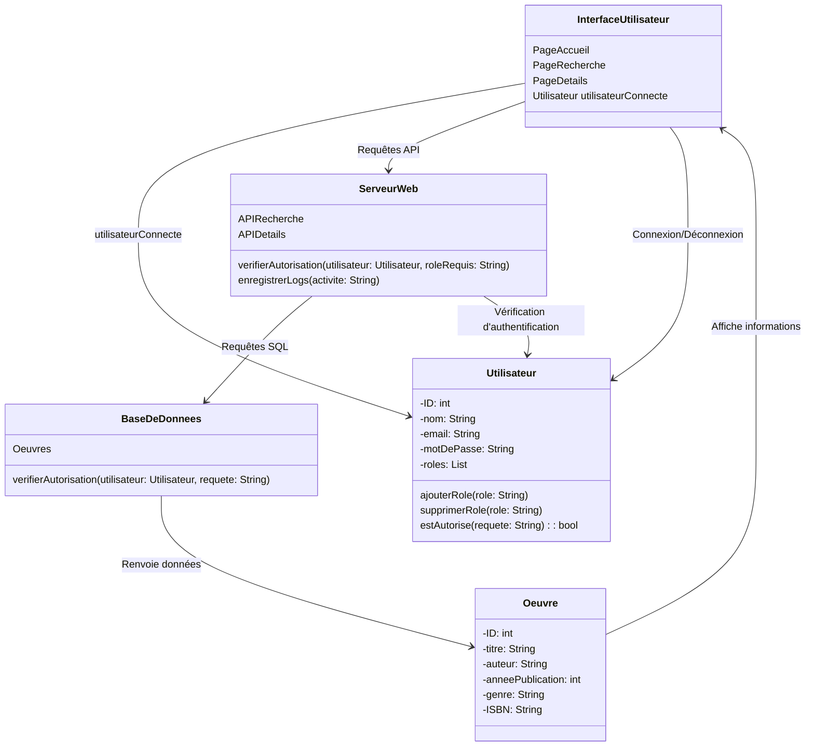

```mermaid
classDiagram
    class InterfaceUtilisateur {
      PageAccueil
      PageRecherche
      PageDetails
      Utilisateur utilisateurConnecte
    }

    class ServeurWeb {
      APIRecherche
      APIDetails
      verifierAutorisation(utilisateur: Utilisateur, roleRequis: String)
      enregistrerLogs(activite: String)
    }

    class BaseDeDonnees {
      Oeuvres
      verifierAutorisation(utilisateur: Utilisateur, requete: String)
    }

    class Oeuvre {
      -ID: int
      -titre: String
      -auteur: String
      -anneePublication: int
      -genre: String
      -ISBN: String
    }

    class Utilisateur {
      -ID: int
      -nom: String
      -email: String
      -motDePasse: String
      -roles: List<String>
      ajouterRole(role: String)
      supprimerRole(role: String)
      estAutorise(requete: String): bool
    }

    InterfaceUtilisateur --> Utilisateur : utilisateurConnecte
    InterfaceUtilisateur --> ServeurWeb : Requêtes API
    ServeurWeb --> BaseDeDonnees : Requêtes SQL
    BaseDeDonnees --> Oeuvre : Renvoie données
    Oeuvre --> InterfaceUtilisateur : Affiche informations
    InterfaceUtilisateur --> Utilisateur : Connexion/Déconnexion
    ServeurWeb --> Utilisateur : Vérification d'authentification
```
