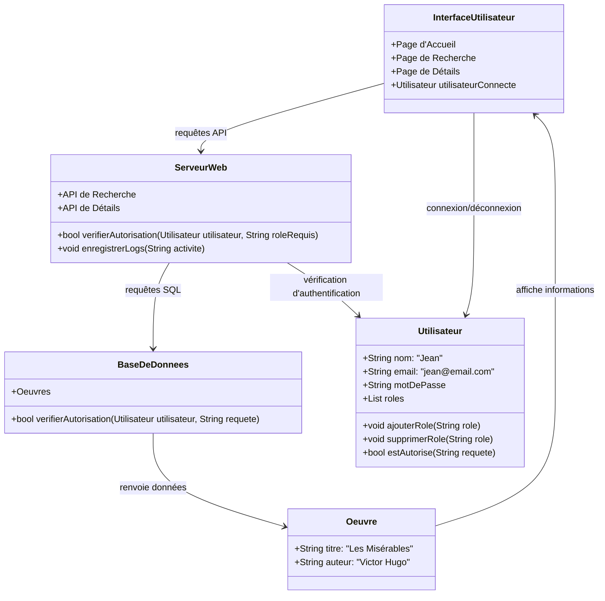

```mermaid
classDiagram
    class InterfaceUtilisateur {
      +Page d'Accueil
      +Page de Recherche
      +Page de Détails
      +Utilisateur utilisateurConnecte
    }
    class ServeurWeb {
      +API de Recherche
      +API de Détails
      +bool verifierAutorisation(Utilisateur utilisateur, String roleRequis)
      +void enregistrerLogs(String activite)
    }
    class BaseDeDonnees {
      +Oeuvres
      +bool verifierAutorisation(Utilisateur utilisateur, String requete)
    }
    class Oeuvre {
      +String titre: "Les Misérables"
      +String auteur: "Victor Hugo"
    }
    class Utilisateur {
      +String nom: "Jean"
      +String email: "jean@email.com"
      +String motDePasse
      +List<String> roles
      +void ajouterRole(String role)
      +void supprimerRole(String role)
      +bool estAutorise(String requete)
    }

    InterfaceUtilisateur --> ServeurWeb : requêtes API
    ServeurWeb --> BaseDeDonnees : requêtes SQL
    BaseDeDonnees --> Oeuvre : renvoie données
    Oeuvre --> InterfaceUtilisateur : affiche informations
    InterfaceUtilisateur --> Utilisateur : connexion/déconnexion
    ServeurWeb --> Utilisateur : vérification d'authentification
```
