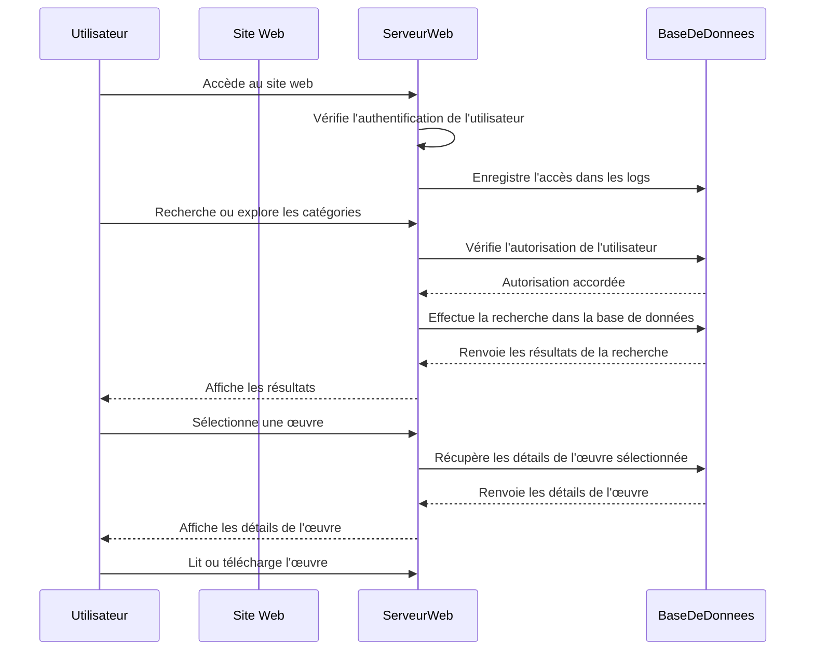

```mermaid
sequenceDiagram
    participant U as Utilisateur
    participant S as Site Web
    participant SW as ServeurWeb
    participant DB as BaseDeDonnees

    U->>SW: Accède au site web
    SW->>SW: Vérifie l'authentification de l'utilisateur
    SW->>DB: Enregistre l'accès dans les logs
    U->>SW: Recherche ou explore les catégories
    SW->>DB: Vérifie l'autorisation de l'utilisateur
    DB-->>SW: Autorisation accordée
    SW->>DB: Effectue la recherche dans la base de données
    DB-->>SW: Renvoie les résultats de la recherche
    SW-->>U: Affiche les résultats
    U->>SW: Sélectionne une œuvre
    SW->>DB: Récupère les détails de l'œuvre sélectionnée
    DB-->>SW: Renvoie les détails de l'œuvre
    SW-->>U: Affiche les détails de l'œuvre
    U->>SW: Lit ou télécharge l'œuvre
```

