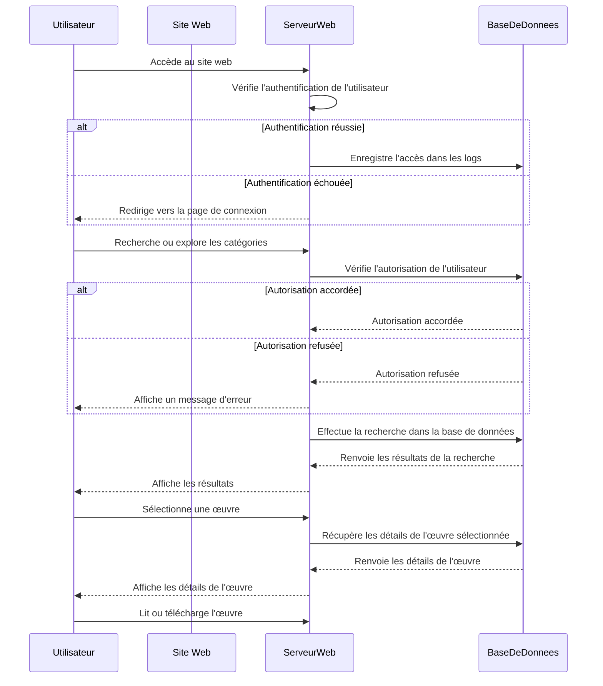

```mermaid
sequenceDiagram
    participant U as Utilisateur
    participant S as Site Web
    participant SW as ServeurWeb
    participant DB as BaseDeDonnees

    U->>SW: Accède au site web

    SW->>SW: Vérifie l'authentification de l'utilisateur
    alt Authentification réussie
        SW->>DB: Enregistre l'accès dans les logs
    else Authentification échouée
        SW-->>U: Redirige vers la page de connexion
    end

    U->>SW: Recherche ou explore les catégories

    SW->>DB: Vérifie l'autorisation de l'utilisateur
    alt Autorisation accordée
        DB-->>SW: Autorisation accordée
    else Autorisation refusée
        DB-->>SW: Autorisation refusée
        SW-->>U: Affiche un message d'erreur
    end

    SW->>DB: Effectue la recherche dans la base de données
    DB-->>SW: Renvoie les résultats de la recherche
    SW-->>U: Affiche les résultats

    U->>SW: Sélectionne une œuvre

    SW->>DB: Récupère les détails de l'œuvre sélectionnée
    DB-->>SW: Renvoie les détails de l'œuvre
    SW-->>U: Affiche les détails de l'œuvre

    U->>SW: Lit ou télécharge l'œuvre
```

