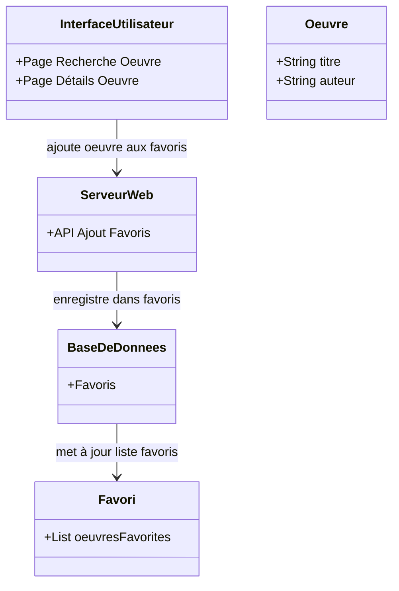

```mermaid
classDiagram
    class InterfaceUtilisateur {
      +Page Recherche Oeuvre
      +Page Détails Oeuvre
    }
    class ServeurWeb {
      +API Ajout Favoris
    }
    class BaseDeDonnees {
      +Favoris
    }
    class Oeuvre {
      +String titre
      +String auteur
    }
    class Favori {
      +List oeuvresFavorites
    }

    InterfaceUtilisateur --> ServeurWeb : ajoute oeuvre aux favoris
    ServeurWeb --> BaseDeDonnees : enregistre dans favoris
    BaseDeDonnees --> Favori : met à jour liste favoris

```
