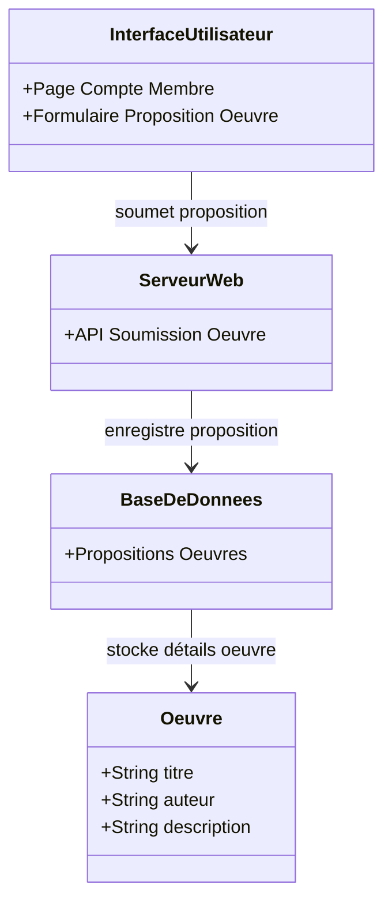

```mermaid
classDiagram
    class InterfaceUtilisateur {
      +Page Compte Membre
      +Formulaire Proposition Oeuvre
    }
    class ServeurWeb {
      +API Soumission Oeuvre
    }
    class BaseDeDonnees {
      +Propositions Oeuvres
    }
    class Oeuvre {
      +String titre
      +String auteur
      +String description
    }

    InterfaceUtilisateur --> ServeurWeb : soumet proposition
    ServeurWeb --> BaseDeDonnees : enregistre proposition
    BaseDeDonnees --> Oeuvre : stocke détails oeuvre

```
