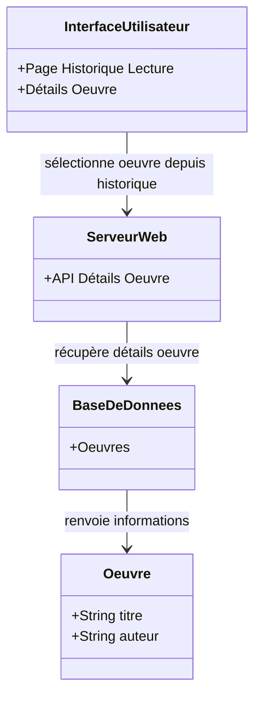

```mermaid
classDiagram
    class InterfaceUtilisateur {
      +Page Historique Lecture
      +Détails Oeuvre
    }
    class ServeurWeb {
      +API Détails Oeuvre
    }
    class BaseDeDonnees {
      +Oeuvres
    }
    class Oeuvre {
      +String titre
      +String auteur
    }

    InterfaceUtilisateur --> ServeurWeb : sélectionne oeuvre depuis historique
    ServeurWeb --> BaseDeDonnees : récupère détails oeuvre
    BaseDeDonnees --> Oeuvre : renvoie informations

```
